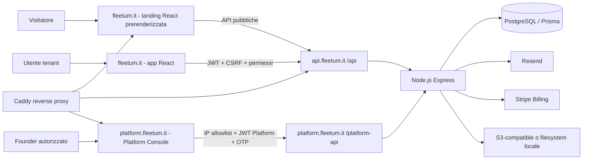

# Fleetum: Sistema, Moduli e Architettura

Stato: tecnico-operativo
Aggiornato: 2026-06-21
Fonte: repository Fleetum, route Express, schema Prisma e frontend React.

## 1. Scopo del prodotto

Fleetum e un SaaS B2B multi-tenant per autonoleggi, rent-a-car e fleet management. Ogni azienda cliente usa un tenant isolato per gestire sedi, veicoli, clienti, prenotazioni, contratti, documenti, manutenzioni, fermi tecnici, report e abbonamento.

Il sito pubblico acquisisce lead e iscrizioni. L'app tenant gestisce l'operativita. La Platform Console e una superficie separata, founder-only, per governare clienti, licenze, fatturazione e salute del sistema.

## 2. Topologia runtime

## 3. Stack

| Area | Tecnologia | Responsabilita |
|---|---|---|
| Frontend | React, TypeScript, Vite, Tailwind | Landing, app tenant, Platform Console |
| Backend | Node.js, Express, TypeScript | API, auth, business logic, job cron |
| Persistenza | PostgreSQL, Prisma | dati tenant, audit, billing, documenti metadata |
| Pagamenti | Stripe | checkout, trial, subscription, webhooks |
| Email | Resend | OTP, inviti, reset password, comunicazioni transazionali |
| File | Local provider o S3/R2/B2 | documenti, foto, PDF, allegati privati |
| Edge | Caddy | HTTPS, SPA fallback, reverse proxy |
| Delivery | GitHub Actions, GHCR, Docker Compose | CI, immagini immutabili, deploy, rollback |

## 4. Superfici applicative

### Landing pubblica

Route pubbliche principali: `/`, `/prezzi`, `/demo`, `/privacy`, `/cookie`, `/termini`, `/dpa` e pagine SEO verticali. La landing non riceve dati tenant e non deve usare route amministrative.

### App tenant

Route protette principali:

- `/dashboard`: panorama operativo.
- `/booking`: calendario, disponibilita e prenotazioni.
- `/booking/contratti`: monitoraggio contratti e PDF.
- `/booking/listini`: listini, pacchetti e preventivi.
- `/anagrafiche/*`: sedi, officine, veicoli, clienti, manutenzioni, scadenze.
- `/fermi/*`: fermi tecnici, kanban, calendario, costi, reminder.
- `/statistiche`: dashboard, analytics, redditivita veicoli ed export.
- `/profilo`, `/profilo/azienda`, `/upgrade`: utenti, branding, dati aziendali e billing.

L'accesso alla UI tenant passa da login e da `BillingActivatedRoute`: un tenant senza trial o abbonamento attivo non entra nell'operativita.

### Platform Console

La Console e separata dalla tenant app e usa `platform.html`, `HashRouter` e `/platform-api`.

Controlli cumulativi:

1. IP del client presente in `PLATFORM_ALLOWED_IPS`.
2. Email e password founder.
3. OTP email monouso di 6 cifre, valido 8 minuti.
4. JWT Platform a vita breve.

Funzioni: overview commerciale e tecnica, tenant, utenti globali, piani, licenze, fatture SaaS, lead demo, analytics sito, security overview e log recenti.

## 5. Multi-tenancy e autorizzazioni

- Il JWT tenant contiene `tenantId`, ruoli e permessi.
- Le query business devono filtrare `tenantId`.
- Le route tenant usano `requireAuth`, `requirePermissions` e, dove necessario, `requireFeature` e `requireValidLicense`.
- I file sono associati a tenant e risorsa; download e delete verificano ownership e producono audit event.
- La Platform Console non riusa il JWT tenant: usa `tokenType: platform` e `platformAdmin: true`.

Permessi ricorrenti: `vehicles:read/write`, `sites:read/write`, `workshops:read/write`, `stoppages:read/write/delete/remind`, `users:read/write`, `stats:read`, `reports:export`, `billing:read/manage`, `privacy:export/manage`, `vehicle:economics:read/write`.

## 6. Domini dati principali

| Dominio | Modelli/concetti principali | Funzione |
|---|---|---|
| Identity | Tenant, User, Role, AuthSession | utenti, ruoli, sessioni e isolamento |
| Anagrafiche | Site, Workshop, Vehicle, RentalCustomer | basi operative dell'autonoleggio |
| Noleggio | RentalBooking, BookingContract, pricing snapshot | prenotazione, contratto, tariffe, stati |
| Flotta | VehicleMaintenance, VehicleDeadline, Stoppage | manutenzione, scadenze, indisponibilita |
| Documenti | StoredFileObject e allegati per risorsa | metadata, checksum, retention e audit |
| Finanza tenant | TenantSubscription, BillingEvent, Invoice | licenza SaaS e fatturazione Fleetum |
| Privacy | ConsentLog, erasure request, retention | export, anonimizzazione e consensi |
| Platform | PlatformOtpChallenge, PlatformAdminCredential, LoginRateLimitState | sicurezza founder-only e reset password |

## 7. Flussi business principali

### Registrazione e attivazione SaaS

1. L'azienda crea account o usa Google OAuth.
2. Completa dati aziendali e onboarding.
3. Seleziona Starter, Pro o Enterprise e ciclo mensile/annuale.
4. Stripe Checkout raccoglie metodo di pagamento anche per il trial.
5. Solo il webhook Stripe verificato aggiorna subscription/licenza.
6. Il license guard abilita l'app tenant dopo stato valido.

### Booking e contratto

1. Operatore sceglie sede, veicolo, cliente e date.
2. Backend verifica disponibilita e tenant ownership.
3. Prezzo, extra e snapshot vengono salvati nella prenotazione.
4. Si genera contratto brandizzato, scaricabile e inviabile.
5. Stato noleggio e riconsegna aggiornano dashboard, audit e report.

### Redditivita veicolo

Il report aggrega booking/contratti, costi manutenzione e costo di acquisto. Espone fatturato, utilizzo, margine stimato, quota investimento recuperata e break-even. I valori economici richiedono permessi finanziari dedicati.

### File e documenti

Upload di foto e allegati passa da validazione MIME/signature, scan base, rimozione EXIF immagini, tenant ownership e metadata DB. Lo storage provider e privato di default; il backend controlla il download oppure crea URL firmati quando previsto.

## 8. Sicurezza e privacy tecnica

- Helmet, CORS ristretto, limiti body e request ID.
- Rate limit generale e specifico per auth/refresh.
- JWT access breve e refresh token con rotazione.
- CSRF per mutazioni autenticare via cookie.
- Password bcrypt; segreti fuori dal repository.
- Stripe webhook con raw body e signature verificata.
- Audit log per azioni sensibili ed export.
- Anonimizzazione/export dati cliente, retention e ConsentLog.
- Resend per email transazionali; non usare SMTP/Nodemailer.

## 9. Configurazione essenziale

Nomi, non valori:

- Database: `DATABASE_URL`, opzionale `DIRECT_URL` per migrazioni.
- Auth: `JWT_SECRET`, `PLATFORM_JWT_SECRET`, `PLATFORM_ADMIN_EMAIL`, `PLATFORM_ADMIN_PASSWORD_HASH`.
- Email: `EMAIL_PROVIDER=resend`, `RESEND_API_KEY`, `RESEND_FROM`.
- Stripe: `STRIPE_SECRET_KEY`, `STRIPE_WEBHOOK_SECRET`, i sei `STRIPE_PRICE_*` mensili/annuali, `STRIPE_PORTAL_RETURN_URL` e opzionale `STRIPE_BILLING_PORTAL_CONFIGURATION_ID`.
- Storage: `STORAGE_PROVIDER`, `S3_ENDPOINT`, `S3_BUCKET`, `S3_ACCESS_KEY_ID`, `S3_SECRET_ACCESS_KEY`, `S3_REGION`.
- Platform: `PLATFORM_ALLOWED_IPS`, `TRUST_PROXY=1` dietro Caddy.

## 10. Limiti e confini

- I documenti legali sono bozze da validare da professionisti.
- L'app non deve esporre API Platform, documenti privati, dati economici o PII alla landing pubblica.
- Il database richiede backup offsite e restore drill periodici.
- Stripe e Resend devono rimanere in test mode finche non sono verificate configurazione live, dominio email e procedure operative.
